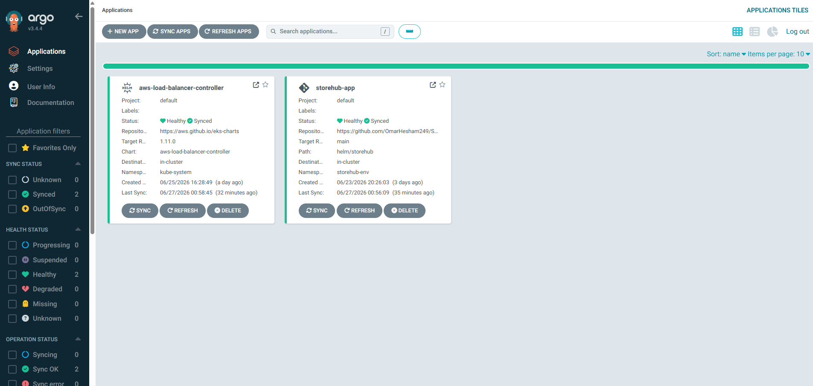

# 🛒 StoreHub — 3-Tier DevSecOps Inventory Management System

<p align="center">

[](https://aws.amazon.com/eks/)
[](https://www.jenkins.io/)
[](https://argo-cd.readthedocs.io/)
[](https://www.docker.com/)
[](https://kubernetes.io/)
[](https://helm.sh/)
[](https://trivy.dev/)
[](https://nginx.org/)

</p>

---

# 📖 Overview

**StoreHub** is a production-ready **3-Tier Inventory Management System** built using a modern **DevSecOps** workflow on **AWS Elastic Kubernetes Service (EKS)**.

The project follows **CI/CD**, **GitOps**, and **Infrastructure Automation** best practices to deliver secure, scalable, and highly available deployments.

It demonstrates how enterprise applications are built, scanned, deployed, and continuously synchronized to Kubernetes with minimal manual intervention.

---

# 🏗️ System Architecture

The application is designed using a highly available **3-Tier Architecture**.

### 🔹 Frontend Tier
- React.js Web Application
- Exposed through an **Nginx Reverse Proxy**
- Provides the user interface

### 🔹 Backend Tier
- Node.js REST API
- Handles business logic
- Communicates securely with PostgreSQL

### 🔹 Database Tier
- PostgreSQL Database
- Persistent storage for inventory records
- Internal communication only

---

# 🖼️ Architecture Diagram

<p align="center">

</p>

---

# 📂 Repository Structure

```text
StoreHub/
│
├── backend/                 # Node.js API source code & Dockerfile
├── frontend/                # React.js UI source code & Dockerfile
│
├── helm/
│   └── storehub/            # Helm Chart for Kubernetes Deployment
│
├── Screenshots/             # Project screenshots & architecture diagrams
│
├── docker-compose.yml       # Local development environment
├── Jenkinsfile              # CI/CD Pipeline
└── README.md
```

---

# 🚀 Key Features

## 🔄 Automated CI/CD

- Fully automated Jenkins Pipeline
- Build
- Test
- Scan
- Push
- Deploy

---

## 🌐 GitOps Deployment

- Managed by **ArgoCD**
- Automatically synchronizes Kubernetes with Git
- Eliminates manual deployments

---

## 🛡️ DevSecOps Security

Automatic security scanning using **Trivy**

✔ Filesystem Scan

✔ Docker Image Scan

✔ Pipeline stops if HIGH or CRITICAL vulnerabilities are detected.

---

## 📦 Kubernetes Deployment

Application deployment is fully managed using:

- Kubernetes
- Helm Charts
- AWS Load Balancer Controller

---

## ⚖️ High Availability

The application runs on:

- AWS Elastic Kubernetes Service (EKS)
- Multiple Worker Nodes
- Load Balancing
- Self-Healing Pods

---

# 🛠️ Technology Stack

| Category | Technologies |
|-----------|--------------|
| Cloud | AWS EC2, AWS EKS |
| Containerization | Docker |
| Orchestration | Kubernetes |
| Package Manager | Helm |
| CI/CD | Jenkins |
| GitOps | ArgoCD |
| Security | Trivy |
| Reverse Proxy | Nginx |
| Backend | Node.js |
| Frontend | React.js |
| Database | PostgreSQL |

---

# 📋 Prerequisites

Before deploying the project, ensure the following tools are installed and configured.

- AWS Account
- AWS CLI
- eksctl
- kubectl
- Docker
- Helm v3+
- Jenkins
- ArgoCD
- Trivy

---

# 🔄 CI/CD GitOps Pipeline

The complete software delivery lifecycle is fully automated.

---

## 1️⃣ Checkout

Jenkins automatically pulls the latest source code whenever changes are pushed to the **main** branch.

---

## 2️⃣ Install & Validate

Both applications are processed simultaneously.

- Install dependencies
- Validate Backend
- Validate Frontend

Using **Parallel Stages** to reduce execution time.

---

## 3️⃣ Build Docker Images

Docker images are built for:

- Frontend
- Backend

Each image is tagged using the Git Commit SHA.

---

## 4️⃣ Security Scan

Trivy performs security scanning for:

- Filesystem
- Docker Images

If HIGH or CRITICAL vulnerabilities are found,

❌ Pipeline Fails.

---

## 5️⃣ Push Images

Verified images are pushed securely to DockerHub.

---

## 6️⃣ GitOps Update

Jenkins automatically updates

```yaml
helm/storehub/values.yaml
```

with the latest image tags.

---

## 7️⃣ Automatic Deployment

ArgoCD detects the Git changes and automatically synchronizes the EKS cluster.

No manual deployment is required.

---

# 📊 Pipeline Workflow

```text
Developer
     │
     ▼
 GitHub Push
     │
     ▼
 Jenkins Pipeline
     │
     ├───────────────► Install Dependencies
     │
     ├───────────────► Validation
     │
     ├───────────────► Docker Build
     │
     ├───────────────► Trivy Scan
     │
     ├───────────────► Docker Push
     │
     └───────────────► Update Helm Values
                           │
                           ▼
                      Git Repository
                           │
                           ▼
                        ArgoCD
                           │
                           ▼
                     AWS EKS Cluster
```

---

# 📷 Project Screenshots

## Jenkins Pipeline

<p align="center">

</p>

---

## ArgoCD Application

<p align="center">

</p>

---

# 🌐 External Access

External traffic is routed securely through an **Nginx Reverse Proxy** running on a dedicated EC2 instance.

```nginx
server {
    listen 80;

    location / {
        proxy_pass http://<WORKER_NODE_IP>:<NODE_PORT>;
    }
}
```

Traffic Flow

```text
User
   │
   ▼
Nginx Reverse Proxy
   │
   ▼
AWS LoadBalancer
   │
   ▼
Kubernetes Service
   │
   ▼
Frontend Pods
   │
   ▼
Backend Pods
   │
   ▼
PostgreSQL
```

---

# 📈 Future Enhancements

## 📊 Monitoring

- Prometheus
- Grafana
- kube-prometheus-stack

---

## 📜 Centralized Logging

Implement:

- Elasticsearch
- Logstash
- Kibana

or

- Fluent Bit
- Elasticsearch
- Kibana

---

## 🗄️ Managed Database

Replace the in-cluster PostgreSQL Pod with:

- Amazon RDS PostgreSQL

Benefits:

- Automated Backups
- Multi-AZ Failover
- Better Scalability
- Production-Grade Reliability

---

# 👨‍💻 Author

**Omar Hesham**

DevOps & Cloud Engineer

- AWS
- Kubernetes
- Jenkins
- Docker
- GitOps
- DevSecOps

---

# ⭐ Support

If you found this project useful, consider giving it a **⭐ Star** on GitHub.